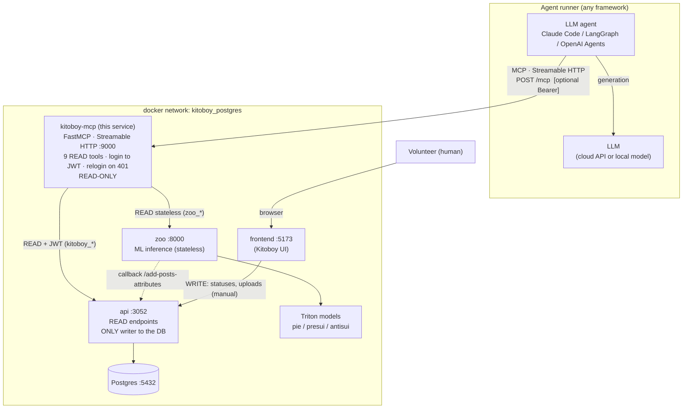
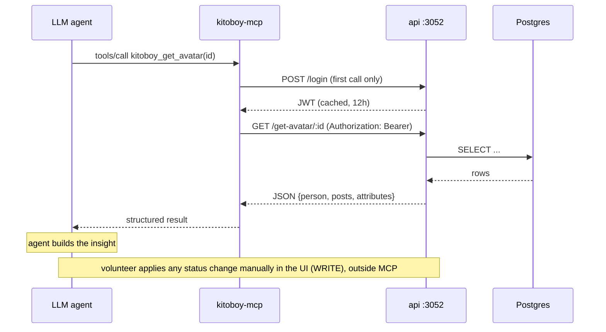
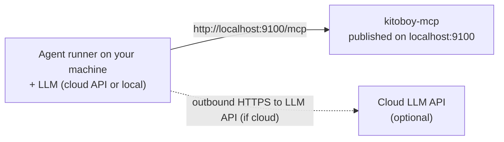
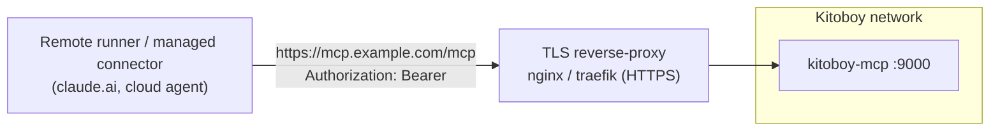

# kitoboy-mcp — Architecture

How the MCP server sits between an LLM agent and the Kitoboy platform.

## Components and data planes

## Request flow (a READ call)

## Key boundaries

- **From MCP it is READ-only** — no mutations. Status changes (the WRITE path) are
  done by a human in the UI, never through MCP.
- **`api` is the only DB writer.** `zoo` does not write to the DB directly; it
  posts results back to `api` via the `/add-posts-attributes` callback.
- **`zoo` is not exposed outside the docker network**, so the MCP container must
  run inside Kitoboy's network (`kitoboy_postgres`).
- **The LLM and the framework are swappable** (cloud↔local, Claude↔LangGraph)
  without changing the MCP server.

---

## Who connects to the MCP endpoint?

Crucial distinction: the MCP endpoint is called by the **agent runner** (the
process executing the agent loop), NOT by the LLM. The LLM's location is a
separate, outbound concern. So:

- A **cloud LLM with a local runner** still talks to MCP over `localhost` — you
  do not expose anything.
- You only need a public/TLS MCP endpoint when the **runner itself** is remote
  (e.g. a managed connector like claude.ai, or an agent running on another host).

### Scenario A — local agent (runner on the same machine)

What to do:
1. Publish the container port to the host: `MCP_PUBLISH_PORT=9100` (already the
   case in our compose), so the endpoint is at `http://localhost:9100/mcp`.
   (Or run the server directly on the host with `uv run kitoboy-mcp`.)
2. Point the agent at that URL (Claude Code `mcpServers`, or the LangGraph
   `MultiServerMCPClient` connection).
3. If the LLM is a cloud model, the runner just needs the provider API key and
   outbound internet — this does NOT affect the MCP connection. `MCP_AUTH_TOKEN`
   can stay unset for a localhost-only endpoint.

### Scenario B — cloud LLM / remote runner

If the agent runner is NOT on the same machine (managed connector, agent in
another cloud/host), the MCP endpoint must be reachable from there:

What to do:
1. Set `MCP_AUTH_TOKEN` — the server then requires `Authorization: Bearer <token>`.
2. Put a TLS reverse-proxy (nginx/traefik) in front and give it a public hostname
   (or a tunnel). The MCP server itself speaks plain HTTP; terminate TLS at the
   proxy. Kitoboy's own nginx does not proxy this service by default — add a
   `location` for it or run a dedicated proxy.
3. Configure the remote runner with the public URL + the bearer token in headers.
4. The LLM being in the cloud is independent of all this — it only matters where
   the runner is.
